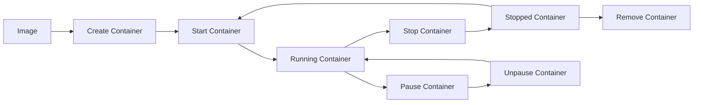

# Module 1: Docker Fundamentals & Setup

## 🎯 Learning Objectives
- Understand Docker architecture and core concepts
- Master essential Docker commands
- Learn container lifecycle management
- Practice with real-world examples

## 📖 Theory: Docker Architecture

### What is Docker?
Docker is a containerization platform that packages applications and their dependencies into lightweight, portable containers. Think of it as a shipping container for software - it ensures your application runs the same way everywhere.

### Key Components:

1. **Docker Engine**: The runtime that manages containers
2. **Docker Images**: Read-only templates used to create containers
3. **Docker Containers**: Running instances of images
4. **Dockerfile**: Instructions to build images
5. **Docker Registry**: Storage for Docker images (Docker Hub, private registries)

### Docker vs Virtual Machines

| Docker Containers | Virtual Machines |
|------------------|------------------|
| Share host OS kernel | Each VM has its own OS |
| Lightweight (MBs) | Heavy (GBs) |
| Fast startup (seconds) | Slow startup (minutes) |
| Better resource utilization | Resource overhead |
| Process-level isolation | Hardware-level isolation |

## 🛠️ Essential Docker Commands

### Image Management
```bash
# List images
docker images

# Pull an image from registry
docker pull nginx:latest

# Build an image from Dockerfile
docker build -t myapp:v1.0 .

# Remove an image
docker rmi nginx:latest

# Search for images
docker search nginx
```

### Container Management
```bash
# Run a container
docker run -d --name mynginx -p 8080:80 nginx:latest

# List running containers
docker ps

# List all containers (including stopped)
docker ps -a

# Stop a container
docker stop mynginx

# Start a stopped container
docker start mynginx

# Remove a container
docker rm mynginx

# Execute commands in running container
docker exec -it mynginx bash
```

### System Management
```bash
# Show Docker system information
docker info

# Show Docker disk usage
docker system df

# Clean up unused resources
docker system prune

# Show container logs
docker logs mynginx

# Follow log output
docker logs -f mynginx
```

## 🔧 Hands-on Lab 1: Your First Container

Let's start with a simple web server:

1. **Run nginx web server**
```bash
docker run -d --name web-server -p 8080:80 nginx:latest
```

2. **Verify it's running**
```bash
docker ps
curl http://localhost:8080
```

3. **Explore the container**
```bash
docker exec -it web-server bash
# Inside container:
ls -la /usr/share/nginx/html/
cat /usr/share/nginx/html/index.html
exit
```

4. **View logs**
```bash
docker logs web-server
```

5. **Stop and remove**
```bash
docker stop web-server
docker rm web-server
```

## 🔧 Hands-on Lab 2: Custom Web Page

Create a custom HTML page and serve it with nginx:

1. **Create HTML file**
```bash
mkdir -p /tmp/html
echo '<h1>Welcome to My Docker Website!</h1><p>This is served from a Docker container.</p>' > /tmp/html/index.html
```

2. **Run nginx with volume mount**
```bash
docker run -d --name custom-web -p 8080:80 -v /tmp/html:/usr/share/nginx/html nginx:latest
```

3. **Test the custom page**
```bash
curl http://localhost:8080
```

## 🔧 Hands-on Lab 3: Interactive Container

Work with an Ubuntu container interactively:

1. **Run Ubuntu container**
```bash
docker run -it --name ubuntu-lab ubuntu:20.04 bash
```

2. **Inside the container, install and use tools**
```bash
apt update
apt install -y curl vim
echo "Hello from Docker!" > /tmp/message.txt
cat /tmp/message.txt
exit
```

3. **Restart and check persistence**
```bash
docker start ubuntu-lab
docker exec -it ubuntu-lab bash
cat /tmp/message.txt  # File should still exist
exit
```

## 📊 Container Lifecycle



## 🎯 Real-world Example: Development Database

Set up a PostgreSQL database for development:

```bash
# Run PostgreSQL container
docker run -d \
  --name dev-postgres \
  -e POSTGRES_DB=myapp \
  -e POSTGRES_USER=developer \
  -e POSTGRES_PASSWORD=devpass123 \
  -p 5432:5432 \
  -v postgres_data:/var/lib/postgresql/data \
  postgres:13

# Connect to database
docker exec -it dev-postgres psql -U developer -d myapp

# Inside PostgreSQL:
\l  # List databases
CREATE TABLE users (id SERIAL PRIMARY KEY, name VARCHAR(100));
INSERT INTO users (name) VALUES ('John Doe'), ('Jane Smith');
SELECT * FROM users;
\q
```

## 🚨 Common Pitfalls & Solutions

### 1. Port Already in Use
**Problem**: `bind: address already in use`
**Solution**: Use different port or stop conflicting service
```bash
docker run -p 8081:80 nginx  # Use different host port
```

### 2. Permission Denied
**Problem**: Volume mount permission issues
**Solution**: Check file permissions and ownership
```bash
sudo chown -R $USER:$USER /path/to/volume
```

### 3. Container Exits Immediately
**Problem**: Container stops right after starting
**Solution**: Check logs and ensure process runs in foreground
```bash
docker logs container-name
```

## 📝 Best Practices - Fundamentals

1. **Always tag your images**: `docker build -t myapp:v1.0 .`
2. **Use specific image versions**: `nginx:1.21` instead of `nginx:latest`
3. **Clean up regularly**: `docker system prune`
4. **Use meaningful container names**: `--name web-server`
5. **Check logs when troubleshooting**: `docker logs container-name`
6. **Don't run as root** in containers when possible
7. **Use `.dockerignore`** to exclude unnecessary files

## 🧪 Practice Exercises

### Exercise 1: Multi-Container Setup
Set up Redis and a simple Python app that uses it:

```bash
# Start Redis
docker run -d --name redis-server redis:6-alpine

# Get Redis container IP
docker inspect redis-server | grep IPAddress

# Run Python container with Redis connection
docker run -it --rm python:3.9-slim bash
# Inside container: pip install redis && python
# Test Redis connection
```

### Exercise 2: Container Resource Limits
```bash
# Run container with memory limit
docker run -d --name limited-nginx --memory=100m nginx:alpine

# Monitor resource usage
docker stats limited-nginx
```

### Exercise 3: Environment Variables
```bash
# Run container with environment variables
docker run -d --name env-test \
  -e ENV=development \
  -e DEBUG=true \
  -e PORT=3000 \
  alpine:latest sleep 300

# Check environment variables
docker exec env-test env
```

## 🎓 Module Summary

You've learned:
- ✅ Docker architecture and core concepts
- ✅ Essential Docker commands for daily use
- ✅ Container lifecycle management
- ✅ Volume mounting and port mapping
- ✅ Environment variable usage
- ✅ Common troubleshooting techniques

## 🔄 Next Steps

Ready for Module 2? You'll learn:
- Advanced Dockerfile techniques
- Multi-stage builds
- Image optimization
- Security best practices

---

**💡 Pro Tip**: Keep a Docker cheat sheet handy and practice these commands daily. Muscle memory is key to Docker mastery!

Continue to: [Module 2: Docker Images & Dockerfile Best Practices](../02-images-best-practices/README.md)