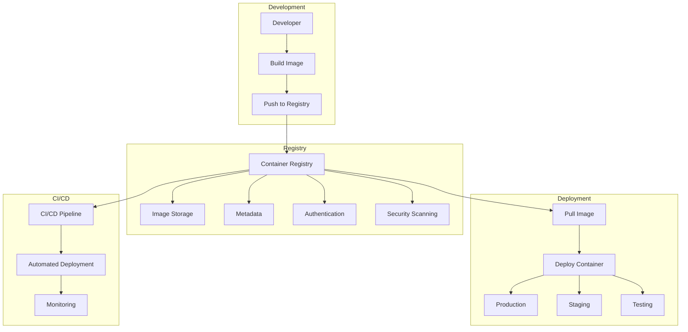

# Module 7: Container Registries & CI/CD Integration

## 🎯 Learning Objectives

By the end of this module, you will:
- Master Docker Hub and private registry management
- Implement automated image building and publishing
- Design CI/CD pipelines with containerized applications
- Understand image lifecycle management and security scanning
- Create multi-environment deployment workflows
- Implement GitOps practices with container registries

---

## 📖 Table of Contents

1. [Container Registry Fundamentals](#container-registry-fundamentals)
2. [Docker Hub Advanced Features](#docker-hub-advanced-features)
3. [Private Registry Implementation](#private-registry-implementation)
4. [Image Lifecycle Management](#image-lifecycle-management)
5. [CI/CD Pipeline Integration](#cicd-pipeline-integration)
6. [Security and Vulnerability Scanning](#security-and-vulnerability-scanning)
7. [GitOps and Automation](#gitops-and-automation)
8. [Multi-Environment Workflows](#multi-environment-workflows)

---

## 🏗️ Container Registry Fundamentals

### Registry Architecture

Container registries are critical infrastructure components that store, manage, and distribute container images across development, testing, and production environments.



### Registry Types and Use Cases

#### 1. Public Registries
- **Docker Hub**: Default public registry
- **Quay.io**: Enterprise-focused public registry
- **Amazon ECR Public**: AWS-managed public registry
- **GitHub Container Registry**: Integrated with GitHub

#### 2. Private Registries
- **Docker Registry**: Official self-hosted solution
- **Harbor**: CNCF graduated enterprise registry
- **Amazon ECR**: AWS-managed private registry
- **Azure Container Registry**: Microsoft Azure solution
- **Google Container Registry**: Google Cloud Platform

#### 3. Hybrid Approaches
- **Multi-registry strategies**: Using both public and private
- **Registry mirroring**: Performance and availability
- **Geographic distribution**: Global deployment strategies

---

## 🐳 Docker Hub Advanced Features

### Organization and Repository Management

Docker Hub provides enterprise-grade features for managing container images at scale.

```yaml
# Docker Hub repository configuration
repository:
  name: "mycompany/webapp"
  visibility: "private"
  
  # Team access management
  teams:
    - name: "developers"
      permission: "read"
    - name: "devops"
      permission: "write"
    - name: "admins"
      permission: "admin"
  
  # Automated builds
  builds:
    source: "github"
    repository: "mycompany/webapp-source"
    branch: "main"
    dockerfile: "Dockerfile"
    build_context: "/"
    
  # Webhooks
  webhooks:
    - name: "deployment-trigger"
      url: "https://api.deployment.com/webhook"
      events: ["push", "build_success"]
```

### Image Tagging Strategies

Effective tagging strategies are crucial for image lifecycle management:

```bash
# Semantic versioning
docker tag myapp:latest myapp:v1.2.3
docker tag myapp:latest myapp:v1.2
docker tag myapp:latest myapp:v1

# Environment-specific tags
docker tag myapp:latest myapp:development
docker tag myapp:latest myapp:staging
docker tag myapp:latest myapp:production

# Git-based tags
docker tag myapp:latest myapp:commit-abc123
docker tag myapp:latest myapp:branch-feature-x
docker tag myapp:latest myapp:pr-456

# Date-based tags
docker tag myapp:latest myapp:$(date +%Y%m%d)
docker tag myapp:latest myapp:$(date +%Y%m%d-%H%M%S)

# Multi-architecture tags
docker tag myapp:latest myapp:amd64
docker tag myapp:latest myapp:arm64
docker tag myapp:latest myapp:multi-arch
```

### Automated Building

Docker Hub's automated build feature connects directly to source code repositories:

```yaml
# .docker/build.yml - Docker Hub build configuration
version: 2

build:
  # Build for multiple architectures
  multi-arch:
    - linux/amd64
    - linux/arm64
    
  # Build arguments
  args:
    BUILD_VERSION: ${SOURCE_COMMIT::8}
    BUILD_DATE: ${BUILD_DATE}
    NODE_ENV: production
    
  # Build hooks
  hooks:
    pre_build:
      - echo "Starting build for ${SOURCE_COMMIT}"
      - ./scripts/pre-build.sh
    post_build:
      - echo "Build completed"
      - ./scripts/post-build.sh
    pre_push:
      - echo "Running security scan"
      - ./scripts/security-scan.sh
    post_push:
      - echo "Triggering deployment"
      - curl -X POST ${WEBHOOK_URL}
      
  # Conditional builds
  conditions:
    - branch: main
      dockerfile: Dockerfile.production
      tag: latest
    - branch: develop
      dockerfile: Dockerfile.development  
      tag: development
    - tag: /^v[0-9.]+$/
      dockerfile: Dockerfile.production
      tag: ${SOURCE_TAG}
```

---

## 🏛️ Private Registry Implementation

### Docker Registry Setup

Setting up a production-ready private registry with security and high availability:

```yaml
# docker-compose.registry.yml
version: '3.8'

services:
  registry:
    image: registry:2.8
    container_name: docker-registry
    restart: unless-stopped
    environment:
      REGISTRY_HTTP_ADDR: 0.0.0.0:5000
      REGISTRY_STORAGE_FILESYSTEM_ROOTDIRECTORY: /var/lib/registry
      REGISTRY_AUTH: htpasswd
      REGISTRY_AUTH_HTPASSWD_REALM: Registry Realm
      REGISTRY_AUTH_HTPASSWD_PATH: /auth/htpasswd
      REGISTRY_HTTP_TLS_CERTIFICATE: /certs/registry.crt
      REGISTRY_HTTP_TLS_KEY: /certs/registry.key
      REGISTRY_STORAGE_DELETE_ENABLED: "true"
      # Garbage collection
      REGISTRY_STORAGE_MAINTENANCE_UPLOADPURGING_ENABLED: "true"
      REGISTRY_STORAGE_MAINTENANCE_UPLOADPURGING_AGE: 168h
      REGISTRY_STORAGE_MAINTENANCE_UPLOADPURGING_INTERVAL: 24h
      REGISTRY_STORAGE_MAINTENANCE_UPLOADPURGING_DRYRUN: "false"
    ports:
      - "5000:5000"
    volumes:
      - registry-data:/var/lib/registry
      - ./auth:/auth:ro
      - ./certs:/certs:ro
      - ./config.yml:/etc/docker/registry/config.yml:ro
    networks:
      - registry-network
    healthcheck:
      test: ["CMD", "wget", "--quiet", "--tries=1", "--spider", "https://localhost:5000/v2/"]
      interval: 30s
      timeout: 10s
      retries: 3

  registry-ui:
    image: joxit/docker-registry-ui:2.5.0
    container_name: registry-ui
    restart: unless-stopped
    environment:
      SINGLE_REGISTRY: "true"
      REGISTRY_TITLE: "Private Docker Registry"
      DELETE_IMAGES: "true"
      SHOW_CONTENT_DIGEST: "true"
      NGINX_PROXY_PASS_URL: "https://registry:5000"
      SHOW_CATALOG_NB_TAGS: "true"
      CATALOG_MIN_BRANCHES: 1
      CATALOG_MAX_BRANCHES: 1
      TAGLIST_PAGE_SIZE: 100
      REGISTRY_SECURED: "true"
      CATALOG_ELEMENTS_LIMIT: 1000
    ports:
      - "8080:80"
    depends_on:
      - registry
    networks:
      - registry-network

  # Registry cleanup service
  registry-cleaner:
    image: mortensrasmussen/docker-registry-cleaner:latest
    container_name: registry-cleaner
    restart: "no"
    environment:
      REGISTRY_URL: "https://registry:5000"
      DRY_RUN: "false"
      KEEP_LAST_VERSIONS: 5
      OLDER_THAN_DAYS: 30
    depends_on:
      - registry
    networks:
      - registry-network
    profiles:
      - cleanup

volumes:
  registry-data:
    driver: local

networks:
  registry-network:
    driver: bridge
```

### Harbor Enterprise Registry

Harbor provides enterprise-grade features including vulnerability scanning, policy management, and replication:

```yaml
# harbor-compose.yml
version: '3.8'

services:
  harbor-log:
    image: goharbor/harbor-log:v2.9.0
    container_name: harbor-log
    restart: always
    volumes:
      - ./harbor/log/:/var/log/docker/:z
      - type: bind
        source: ./harbor/log/harbor/
        target: /var/log/harbor/
      - type: bind
        source: ./harbor/log/rsyslog.d/
        target: /etc/rsyslog.d/
    ports:
      - "127.0.0.1:1514:10514"
    networks:
      - harbor

  registry:
    image: goharbor/registry-photon:v2.9.0
    container_name: registry
    restart: always
    volumes:
      - ./harbor/registry:/storage:z
      - ./harbor/config/registry/:/etc/registry/:z
      - type: bind
        source: ./harbor/config/shared/trust-certificates
        target: /harbor_cust_cert
    networks:
      - harbor
    depends_on:
      - harbor-log

  registryctl:
    image: goharbor/harbor-registryctl:v2.9.0
    container_name: registryctl
    env_file:
      - ./harbor.env
    restart: always
    volumes:
      - ./harbor/registry:/storage:z
      - ./harbor/config/registry/:/etc/registry/:z
      - type: bind
        source: ./harbor/config/registryctl/config.yml
        target: /etc/registryctl/config.yml
    networks:
      - harbor
    depends_on:
      - harbor-log

  postgresql:
    image: goharbor/harbor-db:v2.9.0
    container_name: harbor-db
    restart: always
    volumes:
      - ./harbor/database:/var/lib/postgresql/data:z
    networks:
      harbor:
        aliases:
          - harbor-db
    env_file:
      - ./harbor.env
    depends_on:
      - harbor-log

  core:
    image: goharbor/harbor-core:v2.9.0
    container_name: harbor-core
    env_file:
      - ./harbor.env
    restart: always
    volumes:
      - ./harbor/ca_download/:/etc/core/ca/:z
      - ./harbor/config/core/certificates/:/etc/core/certificates/:z
      - type: bind
        source: ./harbor/config/core/app.conf
        target: /etc/core/app.conf
      - type: bind
        source: ./harbor/config/shared/trust-certificates
        target: /harbor_cust_cert
    networks:
      harbor:
        aliases:
          - harbor-core
    depends_on:
      - harbor-log
      - registry
      - redis
      - postgresql

  portal:
    image: goharbor/harbor-portal:v2.9.0
    container_name: harbor-portal
    restart: always
    volumes:
      - type: bind
        source: ./harbor/config/portal/nginx.conf
        target: /etc/nginx/nginx.conf
    networks:
      - harbor
    depends_on:
      - harbor-log
      - core

  jobservice:
    image: goharbor/harbor-jobservice:v2.9.0
    container_name: harbor-jobservice
    env_file:
      - ./harbor.env
    restart: always
    volumes:
      - ./harbor/job_logs:/var/log/jobs:z
      - type: bind
        source: ./harbor/config/jobservice/config.yml
        target: /etc/jobservice/config.yml
      - type: bind
        source: ./harbor/config/shared/trust-certificates
        target: /harbor_cust_cert
    networks:
      harbor:
        aliases:
          - harbor-jobservice
    depends_on:
      - harbor-log
      - core

  redis:
    image: goharbor/redis-photon:v2.9.0
    container_name: redis
    restart: always
    volumes:
      - ./harbor/redis:/var/lib/redis
    networks:
      harbor:
        aliases:
          - redis
    depends_on:
      - harbor-log

  proxy:
    image: goharbor/nginx-photon:v2.9.0
    container_name: nginx
    restart: always
    volumes:
      - ./harbor/config/nginx:/etc/nginx:z
      - type: bind
        source: ./harbor/config/shared/trust-certificates
        target: /harbor_cust_cert
    networks:
      - harbor
    ports:
      - "80:8080"
      - "443:8443"
    depends_on:
      - harbor-log
      - postgresql
      - registry
      - core
      - portal

networks:
  harbor:
    external: false
```

---

## 📈 Image Lifecycle Management

### Automated Image Tagging and Versioning

Implementing comprehensive image lifecycle management:

```bash
#!/bin/bash
# image-lifecycle-manager.sh

set -euo pipefail

# Configuration
REGISTRY_URL=${REGISTRY_URL:-"harbor.company.com"}
PROJECT_NAME=${PROJECT_NAME:-"webapp"}
IMAGE_NAME=${IMAGE_NAME:-"api"}
GIT_REPO_PATH=${GIT_REPO_PATH:-"."}

# Colors for output
RED='\033[0;31m'
GREEN='\033[0;32m'
YELLOW='\033[1;33m'
BLUE='\033[0;34m'
NC='\033[0m'

log() {
    echo -e "${BLUE}[$(date '+%Y-%m-%d %H:%M:%S')] $1${NC}"
}

success() {
    echo -e "${GREEN}✅ $1${NC}"
}

warning() {
    echo -e "${YELLOW}⚠️  $1${NC}"
}

error() {
    echo -e "${RED}❌ $1${NC}"
}

# Git information extraction
get_git_info() {
    cd "$GIT_REPO_PATH"
    
    # Get current commit information
    GIT_COMMIT=$(git rev-parse HEAD)
    GIT_SHORT_COMMIT=$(git rev-parse --short HEAD)
    GIT_BRANCH=$(git rev-parse --abbrev-ref HEAD)
    GIT_TAG=$(git describe --tags --exact-match 2>/dev/null || echo "")
    GIT_DIRTY=$(git diff --quiet || echo "-dirty")
    
    # Get build metadata
    BUILD_DATE=$(date -u +%Y-%m-%dT%H:%M:%SZ)
    BUILD_NUMBER=${BUILD_NUMBER:-$(date +%Y%m%d%H%M%S)}
    
    # Determine version
    if [[ -n "$GIT_TAG" ]]; then
        VERSION="$GIT_TAG"
    elif [[ "$GIT_BRANCH" == "main" || "$GIT_BRANCH" == "master" ]]; then
        VERSION="latest"
    else
        VERSION="$GIT_BRANCH"
    fi
    
    log "Git Information:"
    log "  Commit: $GIT_COMMIT"
    log "  Short Commit: $GIT_SHORT_COMMIT"
    log "  Branch: $GIT_BRANCH"
    log "  Tag: ${GIT_TAG:-'none'}"
    log "  Version: $VERSION"
    log "  Build Date: $BUILD_DATE"
    log "  Build Number: $BUILD_NUMBER"
}

# Generate comprehensive image tags
generate_image_tags() {
    local base_image="$REGISTRY_URL/$PROJECT_NAME/$IMAGE_NAME"
    
    TAGS=(
        "$base_image:$VERSION"
        "$base_image:build-$BUILD_NUMBER"
        "$base_image:commit-$GIT_SHORT_COMMIT"
    )
    
    # Add semantic version tags if this is a tagged release
    if [[ -n "$GIT_TAG" && "$GIT_TAG" =~ ^v?([0-9]+)\.([0-9]+)\.([0-9]+)$ ]]; then
        local major="${BASH_REMATCH[1]}"
        local minor="${BASH_REMATCH[2]}"
        local patch="${BASH_REMATCH[3]}"
        
        TAGS+=(
            "$base_image:$major"
            "$base_image:$major.$minor"
            "$base_image:$major.$minor.$patch"
        )
    fi
    
    # Add branch-specific tags
    if [[ "$GIT_BRANCH" == "main" || "$GIT_BRANCH" == "master" ]]; then
        TAGS+=("$base_image:latest")
        TAGS+=("$base_image:stable")
    elif [[ "$GIT_BRANCH" == "develop" ]]; then
        TAGS+=("$base_image:development")
        TAGS+=("$base_image:dev")
    elif [[ "$GIT_BRANCH" =~ ^release/ ]]; then
        local release_version=$(echo "$GIT_BRANCH" | sed 's/release\///')
        TAGS+=("$base_image:release-$release_version")
    elif [[ "$GIT_BRANCH" =~ ^feature/ ]]; then
        local feature_name=$(echo "$GIT_BRANCH" | sed 's/feature\///' | tr '/' '-')
        TAGS+=("$base_image:feature-$feature_name")
    fi
    
    # Add date-based tags
    TAGS+=("$base_image:$(date +%Y%m%d)")
    TAGS+=("$base_image:$(date +%Y-%m)")
    
    log "Generated image tags:"
    for tag in "${TAGS[@]}"; do
        log "  - $tag"
    done
}

# Build image with comprehensive metadata
build_image() {
    local dockerfile=${1:-"Dockerfile"}
    local context=${2:-"."}
    
    log "Building image with metadata..."
    
    # Build arguments
    local build_args=(
        --build-arg "BUILD_DATE=$BUILD_DATE"
        --build-arg "BUILD_NUMBER=$BUILD_NUMBER"
        --build-arg "VCS_REF=$GIT_COMMIT"
        --build-arg "VCS_URL=$(git config --get remote.origin.url)"
        --build-arg "VERSION=$VERSION"
        --build-arg "GIT_BRANCH=$GIT_BRANCH"
        --build-arg "GIT_TAG=$GIT_TAG"
    )
    
    # Labels for metadata
    local labels=(
        --label "org.opencontainers.image.created=$BUILD_DATE"
        --label "org.opencontainers.image.version=$VERSION"
        --label "org.opencontainers.image.revision=$GIT_COMMIT"
        --label "org.opencontainers.image.source=$(git config --get remote.origin.url)"
        --label "org.opencontainers.image.title=$PROJECT_NAME/$IMAGE_NAME"
        --label "org.opencontainers.image.description=Automated build from $GIT_BRANCH"
        --label "com.company.build.number=$BUILD_NUMBER"
        --label "com.company.git.branch=$GIT_BRANCH"
        --label "com.company.git.commit=$GIT_COMMIT"
    )
    
    # Primary tag for building
    local primary_tag="${TAGS[0]}"
    
    # Build command
    docker build \
        "${build_args[@]}" \
        "${labels[@]}" \
        -f "$dockerfile" \
        -t "$primary_tag" \
        "$context"
    
    success "Image built successfully: $primary_tag"
}

# Tag image with all generated tags
tag_image() {
    local primary_tag="${TAGS[0]}"
    
    log "Tagging image with all generated tags..."
    
    for tag in "${TAGS[@]:1}"; do
        docker tag "$primary_tag" "$tag"
        log "  Tagged: $tag"
    done
    
    success "Image tagged with ${#TAGS[@]} tags"
}

# Push all tags to registry
push_image() {
    log "Pushing image tags to registry..."
    
    local push_count=0
    local failed_pushes=()
    
    for tag in "${TAGS[@]}"; do
        log "Pushing: $tag"
        
        if docker push "$tag"; then
            ((push_count++))
            success "Pushed: $tag"
        else
            error "Failed to push: $tag"
            failed_pushes+=("$tag")
        fi
    done
    
    if [[ ${#failed_pushes[@]} -eq 0 ]]; then
        success "All $push_count tags pushed successfully"
    else
        error "Failed to push ${#failed_pushes[@]} tags:"
        for failed_tag in "${failed_pushes[@]}"; do
            error "  - $failed_tag"
        done
        return 1
    fi
}

# Image security scanning
scan_image() {
    local image_tag="${TAGS[0]}"
    
    log "Performing security scan on: $image_tag"
    
    # Using Trivy for vulnerability scanning
    if command -v trivy >/dev/null 2>&1; then
        log "Running Trivy security scan..."
        
        # Create scan results directory
        mkdir -p "./scan-results"
        
        # Scan for vulnerabilities
        trivy image \
            --format json \
            --output "./scan-results/vulnerability-report.json" \
            "$image_tag"
        
        # Check for critical vulnerabilities
        local critical_vulns=$(jq -r '.Results[].Vulnerabilities[]? | select(.Severity == "CRITICAL") | .VulnerabilityID' "./scan-results/vulnerability-report.json" 2>/dev/null | wc -l)
        local high_vulns=$(jq -r '.Results[].Vulnerabilities[]? | select(.Severity == "HIGH") | .VulnerabilityID' "./scan-results/vulnerability-report.json" 2>/dev/null | wc -l)
        
        log "Security scan results:"
        log "  Critical vulnerabilities: $critical_vulns"
        log "  High vulnerabilities: $high_vulns"
        
        if [[ $critical_vulns -gt 0 ]]; then
            error "Critical vulnerabilities found! Build should be failed."
            return 1
        elif [[ $high_vulns -gt 5 ]]; then
            warning "High number of high-severity vulnerabilities found"
            return 2
        else
            success "Security scan passed"
        fi
    else
        warning "Trivy not found, skipping security scan"
    fi
}

# Generate SBOM (Software Bill of Materials)
generate_sbom() {
    local image_tag="${TAGS[0]}"
    
    log "Generating SBOM for: $image_tag"
    
    # Create SBOM directory
    mkdir -p "./sbom"
    
    # Generate SBOM using syft
    if command -v syft >/dev/null 2>&1; then
        syft "$image_tag" -o json > "./sbom/sbom.json"
        syft "$image_tag" -o spdx-json > "./sbom/sbom.spdx.json"
        success "SBOM generated successfully"
    else
        warning "Syft not found, skipping SBOM generation"
    fi
}

# Cleanup old images
cleanup_old_images() {
    local days_to_keep=${1:-7}
    
    log "Cleaning up images older than $days_to_keep days..."
    
    # Remove dangling images
    docker image prune -f
    
    # Remove old images (this is a simplified example)
    docker images --format "table {{.Repository}}:{{.Tag}}\t{{.CreatedAt}}" | \
    grep "$REGISTRY_URL/$PROJECT_NAME/$IMAGE_NAME" | \
    while IFS=$'\t' read -r image created; do
        if [[ $(date -d "$created" +%s) -lt $(date -d "$days_to_keep days ago" +%s) ]]; then
            log "Removing old image: $image"
            docker rmi "$image" 2>/dev/null || true
        fi
    done
    
    success "Image cleanup completed"
}

# Generate image manifest
generate_manifest() {
    local manifest_file="./image-manifest.json"
    
    log "Generating image manifest..."
    
    cat > "$manifest_file" << EOF
{
  "image": "${TAGS[0]}",
  "tags": $(printf '%s\n' "${TAGS[@]}" | jq -R . | jq -s .),
  "build": {
    "date": "$BUILD_DATE",
    "number": "$BUILD_NUMBER",
    "git": {
      "commit": "$GIT_COMMIT",
      "short_commit": "$GIT_SHORT_COMMIT",
      "branch": "$GIT_BRANCH",
      "tag": "$GIT_TAG",
      "repository": "$(git config --get remote.origin.url)"
    }
  },
  "metadata": {
    "project": "$PROJECT_NAME",
    "image_name": "$IMAGE_NAME",
    "registry": "$REGISTRY_URL",
    "version": "$VERSION"
  },
  "files": {
    "vulnerability_report": "./scan-results/vulnerability-report.json",
    "sbom_json": "./sbom/sbom.json",
    "sbom_spdx": "./sbom/sbom.spdx.json"
  }
}
EOF
    
    success "Image manifest generated: $manifest_file"
}

# Main execution function
main() {
    local operation=${1:-"all"}
    
    case "$operation" in
        "build")
            get_git_info
            generate_image_tags
            build_image
            tag_image
            ;;
        "scan")
            get_git_info
            generate_image_tags
            scan_image
            generate_sbom
            ;;
        "push")
            get_git_info
            generate_image_tags
            push_image
            ;;
        "all")
            get_git_info
            generate_image_tags
            build_image
            tag_image
            scan_image
            generate_sbom
            push_image
            generate_manifest
            ;;
        "cleanup")
            cleanup_old_images "${2:-7}"
            ;;
        *)
            echo "Usage: $0 {build|scan|push|all|cleanup} [days_to_keep]"
            echo ""
            echo "Operations:"
            echo "  build   - Build and tag image"
            echo "  scan    - Perform security scan and generate SBOM"
            echo "  push    - Push all tags to registry"
            echo "  all     - Complete build, scan, and push workflow"
            echo "  cleanup - Clean up old images (default: 7 days)"
            exit 1
            ;;
    esac
}

# Execute main function
main "$@"
```

---

## 🚀 CI/CD Pipeline Integration

### GitHub Actions Workflow

Complete CI/CD pipeline with container registry integration:

```yaml
# .github/workflows/container-cicd.yml
name: Container CI/CD Pipeline

on:
  push:
    branches: [ main, develop, 'release/*', 'feature/*' ]
    tags: [ 'v*' ]
  pull_request:
    branches: [ main, develop ]

env:
  REGISTRY_URL: harbor.company.com
  PROJECT_NAME: webapp
  IMAGE_NAME: api

jobs:
  build-and-test:
    runs-on: ubuntu-latest
    
    outputs:
      image-tag: ${{ steps.meta.outputs.tags }}
      image-digest: ${{ steps.build.outputs.digest }}
      
    steps:
    - name: Checkout code
      uses: actions/checkout@v4
      with:
        fetch-depth: 0
        
    - name: Set up Docker Buildx
      uses: docker/setup-buildx-action@v3
      
    - name: Log in to Container Registry
      uses: docker/login-action@v3
      with:
        registry: ${{ env.REGISTRY_URL }}
        username: ${{ secrets.REGISTRY_USERNAME }}
        password: ${{ secrets.REGISTRY_PASSWORD }}
        
    - name: Extract metadata
      id: meta
      uses: docker/metadata-action@v5
      with:
        images: ${{ env.REGISTRY_URL }}/${{ env.PROJECT_NAME }}/${{ env.IMAGE_NAME }}
        tags: |
          # Branch-based tags
          type=ref,event=branch
          type=ref,event=pr
          
          # Semantic versioning for tags
          type=semver,pattern={{version}}
          type=semver,pattern={{major}}.{{minor}}
          type=semver,pattern={{major}}
          
          # Special tags
          type=raw,value=latest,enable={{is_default_branch}}
          type=raw,value=stable,enable={{is_default_branch}}
          
          # Commit-based tags
          type=sha,prefix={{branch}}-
          
        labels: |
          org.opencontainers.image.title=${{ env.PROJECT_NAME }}/${{ env.IMAGE_NAME }}
          org.opencontainers.image.description=Automated build from ${{ github.ref_name }}
          org.opencontainers.image.vendor=Company Name
          com.company.build.number=${{ github.run_number }}
          com.company.git.branch=${{ github.ref_name }}
          
    - name: Build container image
      id: build
      uses: docker/build-push-action@v5
      with:
        context: .
        file: ./Dockerfile
        platforms: linux/amd64,linux/arm64
        push: false
        tags: ${{ steps.meta.outputs.tags }}
        labels: ${{ steps.meta.outputs.labels }}
        cache-from: type=gha
        cache-to: type=gha,mode=max
        build-args: |
          BUILD_DATE=${{ fromJSON(steps.meta.outputs.json).labels['org.opencontainers.image.created'] }}
          BUILD_NUMBER=${{ github.run_number }}
          VCS_REF=${{ github.sha }}
          VCS_URL=${{ github.repositoryUrl }}
          VERSION=${{ steps.meta.outputs.version }}
          
    - name: Run container structure tests
      run: |
        # Install container-structure-test
        curl -LO https://storage.googleapis.com/container-structure-test/latest/container-structure-test-linux-amd64
        chmod +x container-structure-test-linux-amd64
        sudo mv container-structure-test-linux-amd64 /usr/local/bin/container-structure-test
        
        # Run tests
        container-structure-test test --image ${{ steps.meta.outputs.tags }} --config container-structure-test.yaml
        
    - name: Run security scan with Trivy
      uses: aquasecurity/trivy-action@master
      with:
        image-ref: ${{ steps.meta.outputs.tags }}
        format: 'sarif'
        output: 'trivy-results.sarif'
        severity: 'CRITICAL,HIGH'
        
    - name: Upload Trivy scan results
      uses: github/codeql-action/upload-sarif@v3
      if: always()
      with:
        sarif_file: 'trivy-results.sarif'
        
    - name: Generate SBOM
      uses: anchore/sbom-action@v0
      with:
        image: ${{ steps.meta.outputs.tags }}
        format: 'spdx-json'
        output-file: 'sbom.spdx.json'
        
    - name: Upload SBOM
      uses: actions/upload-artifact@v3
      with:
        name: sbom
        path: sbom.spdx.json
        
    - name: Push image to registry
      if: github.event_name != 'pull_request'
      run: |
        docker buildx build \
          --platform linux/amd64,linux/arm64 \
          --push \
          -t ${{ steps.meta.outputs.tags }} \
          --label "${{ steps.meta.outputs.labels }}" \
          .

  security-scan:
    needs: build-and-test
    runs-on: ubuntu-latest
    if: github.event_name != 'pull_request'
    
    steps:
    - name: Run comprehensive security scan
      uses: aquasecurity/trivy-action@master
      with:
        image-ref: ${{ needs.build-and-test.outputs.image-tag }}
        format: 'json'
        output: 'vulnerability-report.json'
        
    - name: Check vulnerability threshold
      run: |
        # Parse vulnerability report
        CRITICAL=$(jq '[.Results[]?.Vulnerabilities[]? | select(.Severity == "CRITICAL")] | length' vulnerability-report.json)
        HIGH=$(jq '[.Results[]?.Vulnerabilities[]? | select(.Severity == "HIGH")] | length' vulnerability-report.json)
        
        echo "Critical vulnerabilities: $CRITICAL"
        echo "High vulnerabilities: $HIGH"
        
        # Fail if critical vulnerabilities found
        if [ "$CRITICAL" -gt 0 ]; then
          echo "::error::Critical vulnerabilities found: $CRITICAL"
          exit 1
        fi
        
        # Warn if too many high vulnerabilities
        if [ "$HIGH" -gt 10 ]; then
          echo "::warning::High number of high-severity vulnerabilities: $HIGH"
        fi

  deploy-staging:
    needs: [build-and-test, security-scan]
    runs-on: ubuntu-latest
    if: github.ref == 'refs/heads/develop'
    
    environment:
      name: staging
      url: https://staging.company.com
      
    steps:
    - name: Deploy to staging
      run: |
        # Deployment logic here
        echo "Deploying ${{ needs.build-and-test.outputs.image-tag }} to staging"
        
        # Update deployment manifest
        kubectl set image deployment/webapp-api \
          api=${{ needs.build-and-test.outputs.image-tag }} \
          -n staging
          
        # Wait for rollout
        kubectl rollout status deployment/webapp-api -n staging --timeout=300s

  deploy-production:
    needs: [build-and-test, security-scan]
    runs-on: ubuntu-latest
    if: startsWith(github.ref, 'refs/tags/v')
    
    environment:
      name: production
      url: https://app.company.com
      
    steps:
    - name: Deploy to production
      run: |
        echo "Deploying ${{ needs.build-and-test.outputs.image-tag }} to production"
        
        # Blue-green deployment
        ./scripts/blue-green-deploy.sh ${{ needs.build-and-test.outputs.image-tag }}

  cleanup:
    needs: [deploy-staging, deploy-production]
    runs-on: ubuntu-latest
    if: always()
    
    steps:
    - name: Clean up old images
      run: |
        # Cleanup logic for registry
        ./scripts/cleanup-registry.sh --days 30 --keep-latest 10
```

### GitLab CI/CD Pipeline

```yaml
# .gitlab-ci.yml
stages:
  - build
  - test
  - security
  - deploy-staging
  - deploy-production

variables:
  REGISTRY_URL: $CI_REGISTRY
  IMAGE_NAME: $CI_REGISTRY_IMAGE
  DOCKER_DRIVER: overlay2
  DOCKER_TLS_CERTDIR: "/certs"

services:
  - docker:24-dind

before_script:
  - echo $CI_REGISTRY_PASSWORD | docker login -u $CI_REGISTRY_USER --password-stdin $CI_REGISTRY

build:
  stage: build
  script:
    - |
      # Determine tags based on branch/tag
      if [[ "$CI_COMMIT_TAG" ]]; then
        TAGS="$IMAGE_NAME:$CI_COMMIT_TAG $IMAGE_NAME:latest"
      elif [[ "$CI_COMMIT_BRANCH" == "main" ]]; then
        TAGS="$IMAGE_NAME:latest $IMAGE_NAME:stable"
      else
        TAGS="$IMAGE_NAME:$CI_COMMIT_BRANCH-$CI_COMMIT_SHORT_SHA"
      fi
      
      # Build image
      docker build \
        --build-arg BUILD_DATE=$(date -u +%Y-%m-%dT%H:%M:%SZ) \
        --build-arg BUILD_NUMBER=$CI_PIPELINE_ID \
        --build-arg VCS_REF=$CI_COMMIT_SHA \
        --build-arg VERSION=${CI_COMMIT_TAG:-$CI_COMMIT_BRANCH} \
        --label "org.opencontainers.image.created=$(date -u +%Y-%m-%dT%H:%M:%SZ)" \
        --label "org.opencontainers.image.version=${CI_COMMIT_TAG:-$CI_COMMIT_BRANCH}" \
        --label "org.opencontainers.image.revision=$CI_COMMIT_SHA" \
        --label "com.company.build.number=$CI_PIPELINE_ID" \
        -t $IMAGE_NAME:$CI_COMMIT_SHA \
        .
      
      # Tag with all generated tags
      for tag in $TAGS; do
        docker tag $IMAGE_NAME:$CI_COMMIT_SHA $tag
      done
      
      # Push all tags
      for tag in $TAGS; do
        docker push $tag
      done
  artifacts:
    reports:
      dotenv: build.env
    expire_in: 1 hour

test:
  stage: test
  script:
    - docker run --rm $IMAGE_NAME:$CI_COMMIT_SHA npm test
    - docker run --rm $IMAGE_NAME:$CI_COMMIT_SHA npm run lint
  dependencies:
    - build

security_scan:
  stage: security
  image: 
    name: aquasec/trivy:latest
    entrypoint: [""]
  script:
    - trivy image --exit-code 1 --severity CRITICAL $IMAGE_NAME:$CI_COMMIT_SHA
    - trivy image --format json --output vulnerability-report.json $IMAGE_NAME:$CI_COMMIT_SHA
  artifacts:
    reports:
      container_scanning: vulnerability-report.json
    expire_in: 1 week
  dependencies:
    - build

deploy_staging:
  stage: deploy-staging
  script:
    - |
      # Deploy to staging environment
      kubectl config use-context staging
      kubectl set image deployment/webapp api=$IMAGE_NAME:$CI_COMMIT_SHA -n staging
      kubectl rollout status deployment/webapp -n staging --timeout=300s
  environment:
    name: staging
    url: https://staging.company.com
  only:
    - develop
  dependencies:
    - security_scan

deploy_production:
  stage: deploy-production
  script:
    - |
      # Blue-green deployment to production
      ./scripts/blue-green-deploy.sh $IMAGE_NAME:$CI_COMMIT_TAG
  environment:
    name: production
    url: https://app.company.com
  only:
    - tags
  when: manual
  dependencies:
    - security_scan
```

---

## 🔒 Security and Vulnerability Scanning

### Comprehensive Security Pipeline

```bash
#!/bin/bash
# security-pipeline.sh

set -euo pipefail

IMAGE_TAG=${1:-""}
SCAN_OUTPUT_DIR="./security-reports"
FAIL_ON_CRITICAL=${FAIL_ON_CRITICAL:-"true"}
FAIL_ON_HIGH_COUNT=${FAIL_ON_HIGH_COUNT:-"10"}

# Colors
RED='\033[0;31m'
GREEN='\033[0;32m'
YELLOW='\033[1;33m'
BLUE='\033[0;34m'
NC='\033[0m'

log() {
    echo -e "${BLUE}[$(date '+%Y-%m-%d %H:%M:%S')] $1${NC}"
}

success() {
    echo -e "${GREEN}✅ $1${NC}"
}

warning() {
    echo -e "${YELLOW}⚠️  $1${NC}"
}

error() {
    echo -e "${RED}❌ $1${NC}"
}

# Create output directory
mkdir -p "$SCAN_OUTPUT_DIR"

# Vulnerability scanning with Trivy
run_trivy_scan() {
    local image="$1"
    
    log "Running Trivy vulnerability scan..."
    
    # JSON report for processing
    trivy image \
        --format json \
        --output "$SCAN_OUTPUT_DIR/trivy-vulnerabilities.json" \
        "$image"
    
    # Human-readable report
    trivy image \
        --format table \
        --output "$SCAN_OUTPUT_DIR/trivy-vulnerabilities.txt" \
        "$image"
    
    # SARIF report for GitHub
    trivy image \
        --format sarif \
        --output "$SCAN_OUTPUT_DIR/trivy-vulnerabilities.sarif" \
        "$image"
    
    # Parse results
    local critical_count=$(jq '[.Results[]?.Vulnerabilities[]? | select(.Severity == "CRITICAL")] | length' "$SCAN_OUTPUT_DIR/trivy-vulnerabilities.json")
    local high_count=$(jq '[.Results[]?.Vulnerabilities[]? | select(.Severity == "HIGH")] | length' "$SCAN_OUTPUT_DIR/trivy-vulnerabilities.json")
    local medium_count=$(jq '[.Results[]?.Vulnerabilities[]? | select(.Severity == "MEDIUM")] | length' "$SCAN_OUTPUT_DIR/trivy-vulnerabilities.json")
    local low_count=$(jq '[.Results[]?.Vulnerabilities[]? | select(.Severity == "LOW")] | length' "$SCAN_OUTPUT_DIR/trivy-vulnerabilities.json")
    
    log "Vulnerability scan results:"
    log "  Critical: $critical_count"
    log "  High: $high_count"
    log "  Medium: $medium_count"
    log "  Low: $low_count"
    
    # Check thresholds
    local exit_code=0
    
    if [[ "$critical_count" -gt 0 && "$FAIL_ON_CRITICAL" == "true" ]]; then
        error "Critical vulnerabilities found: $critical_count"
        exit_code=1
    fi
    
    if [[ "$high_count" -gt "$FAIL_ON_HIGH_COUNT" ]]; then
        error "Too many high-severity vulnerabilities: $high_count (limit: $FAIL_ON_HIGH_COUNT)"
        exit_code=1
    fi
    
    return $exit_code
}

# Secret scanning with TruffleHog
run_secret_scan() {
    local image="$1"
    
    log "Running TruffleHog secret scan..."
    
    if command -v trufflehog >/dev/null 2>&1; then
        # Create temporary container to extract filesystem
        local container_id=$(docker create "$image")
        local temp_dir=$(mktemp -d)
        
        # Export container filesystem
        docker export "$container_id" | tar -xC "$temp_dir"
        docker rm "$container_id"
        
        # Scan for secrets
        trufflehog filesystem \
            --json \
            --output "$SCAN_OUTPUT_DIR/trufflehog-secrets.json" \
            "$temp_dir" || true
        
        # Parse results
        local secret_count=$(jq '. | length' "$SCAN_OUTPUT_DIR/trufflehog-secrets.json" 2>/dev/null || echo "0")
        
        log "Secret scan results: $secret_count potential secrets found"
        
        # Cleanup
        rm -rf "$temp_dir"
        
        if [[ "$secret_count" -gt 0 ]]; then
            warning "Potential secrets detected in image"
            jq -r '.[] | "  - \(.DetectorName): \(.Raw[:50])..."' "$SCAN_OUTPUT_DIR/trufflehog-secrets.json" || true
            return 1
        fi
    else
        warning "TruffleHog not found, skipping secret scan"
    fi
    
    return 0
}

# Configuration scanning with Docker Bench
run_docker_bench() {
    local image="$1"
    
    log "Running Docker Bench security checks..."
    
    if command -v docker-bench-security >/dev/null 2>&1; then
        docker-bench-security \
            --json \
            --output "$SCAN_OUTPUT_DIR/docker-bench.json" || true
        
        # Parse results
        local warnings=$(jq '[.checks[] | select(.result == "WARN")] | length' "$SCAN_OUTPUT_DIR/docker-bench.json" 2>/dev/null || echo "0")
        local failures=$(jq '[.checks[] | select(.result == "FAIL")] | length' "$SCAN_OUTPUT_DIR/docker-bench.json" 2>/dev/null || echo "0")
        
        log "Docker Bench results:"
        log "  Warnings: $warnings"
        log "  Failures: $failures"
        
        if [[ "$failures" -gt 0 ]]; then
            warning "Docker Bench security failures detected"
            return 1
        fi
    else
        warning "Docker Bench not found, skipping configuration scan"
    fi
    
    return 0
}

# License scanning
run_license_scan() {
    local image="$1"
    
    log "Running license scan..."
    
    # Use syft to generate SBOM and then scan licenses
    if command -v syft >/dev/null 2>&1; then
        syft "$image" \
            --output json \
            --file "$SCAN_OUTPUT_DIR/sbom.json"
        
        # Extract license information
        jq -r '.artifacts[] | select(.licenses != null) | "\(.name): \(.licenses[].value)"' \
            "$SCAN_OUTPUT_DIR/sbom.json" > "$SCAN_OUTPUT_DIR/licenses.txt" || true
        
        # Check for problematic licenses
        local problematic_licenses=("GPL-3.0" "AGPL-3.0" "SSPL-1.0")
        local license_issues=0
        
        for license in "${problematic_licenses[@]}"; do
            if grep -q "$license" "$SCAN_OUTPUT_DIR/licenses.txt"; then
                warning "Problematic license found: $license"
                ((license_issues++))
            fi
        done
        
        log "License scan completed. Issues found: $license_issues"
        
        if [[ "$license_issues" -gt 0 ]]; then
            return 1
        fi
    else
        warning "Syft not found, skipping license scan"
    fi
    
    return 0
}

# Malware scanning with ClamAV
run_malware_scan() {
    local image="$1"
    
    log "Running malware scan..."
    
    if command -v clamscan >/dev/null 2>&1; then
        # Update virus definitions
        freshclam --quiet || true
        
        # Create temporary container to scan
        local container_id=$(docker create "$image")
        local temp_dir=$(mktemp -d)
        
        # Export and scan filesystem
        docker export "$container_id" | tar -xC "$temp_dir"
        docker rm "$container_id"
        
        # Scan for malware
        if clamscan -r --infected --remove "$temp_dir" > "$SCAN_OUTPUT_DIR/malware-scan.txt" 2>&1; then
            success "No malware detected"
            rm -rf "$temp_dir"
            return 0
        else
            error "Malware detected!"
            cat "$SCAN_OUTPUT_DIR/malware-scan.txt"
            rm -rf "$temp_dir"
            return 1
        fi
    else
        warning "ClamAV not found, skipping malware scan"
        return 0
    fi
}

# Generate security report
generate_security_report() {
    local image="$1"
    
    log "Generating comprehensive security report..."
    
    cat > "$SCAN_OUTPUT_DIR/security-report.md" << EOF
# Security Scan Report

## Image Information
- **Image**: $image
- **Scan Date**: $(date -u +%Y-%m-%dT%H:%M:%SZ)
- **Scanner Version**: Multiple tools

## Vulnerability Summary

$(if [[ -f "$SCAN_OUTPUT_DIR/trivy-vulnerabilities.json" ]]; then
    cat << EOV
### Trivy Vulnerability Scan
- **Critical**: $(jq '[.Results[]?.Vulnerabilities[]? | select(.Severity == "CRITICAL")] | length' "$SCAN_OUTPUT_DIR/trivy-vulnerabilities.json")
- **High**: $(jq '[.Results[]?.Vulnerabilities[]? | select(.Severity == "HIGH")] | length' "$SCAN_OUTPUT_DIR/trivy-vulnerabilities.json")
- **Medium**: $(jq '[.Results[]?.Vulnerabilities[]? | select(.Severity == "MEDIUM")] | length' "$SCAN_OUTPUT_DIR/trivy-vulnerabilities.json")
- **Low**: $(jq '[.Results[]?.Vulnerabilities[]? | select(.Severity == "LOW")] | length' "$SCAN_OUTPUT_DIR/trivy-vulnerabilities.json")

#### Top Critical Vulnerabilities
$(jq -r '.Results[]?.Vulnerabilities[]? | select(.Severity == "CRITICAL") | "- **\(.VulnerabilityID)**: \(.Title // "No title available")"' "$SCAN_OUTPUT_DIR/trivy-vulnerabilities.json" | head -10)
EOV
fi)

## Security Checks

$(if [[ -f "$SCAN_OUTPUT_DIR/trufflehog-secrets.json" ]]; then
    echo "### Secret Scan"
    echo "- **Potential Secrets**: $(jq '. | length' "$SCAN_OUTPUT_DIR/trufflehog-secrets.json")"
    echo ""
fi)

$(if [[ -f "$SCAN_OUTPUT_DIR/docker-bench.json" ]]; then
    echo "### Docker Bench Security"
    echo "- **Warnings**: $(jq '[.checks[] | select(.result == "WARN")] | length' "$SCAN_OUTPUT_DIR/docker-bench.json")"
    echo "- **Failures**: $(jq '[.checks[] | select(.result == "FAIL")] | length' "$SCAN_OUTPUT_DIR/docker-bench.json")"
    echo ""
fi)

## Recommendations

1. **Update Base Image**: Use the latest secure base image
2. **Patch Vulnerabilities**: Address critical and high-severity vulnerabilities
3. **Remove Secrets**: Ensure no secrets are embedded in the image
4. **Follow Security Best Practices**: Implement Docker security recommendations
5. **Regular Scanning**: Integrate security scanning into CI/CD pipeline

## Files Generated

- Vulnerability Report (JSON): trivy-vulnerabilities.json
- Vulnerability Report (SARIF): trivy-vulnerabilities.sarif
- Secret Scan Results: trufflehog-secrets.json
- Docker Bench Results: docker-bench.json
- SBOM: sbom.json
- License Information: licenses.txt
EOF

    success "Security report generated: $SCAN_OUTPUT_DIR/security-report.md"
}

# Main execution
main() {
    if [[ -z "$IMAGE_TAG" ]]; then
        error "Usage: $0 <image_tag>"
        echo "Example: $0 myapp:latest"
        exit 1
    fi
    
    log "Starting comprehensive security scan for: $IMAGE_TAG"
    
    local exit_code=0
    
    # Run all security scans
    run_trivy_scan "$IMAGE_TAG" || exit_code=1
    run_secret_scan "$IMAGE_TAG" || exit_code=1
    run_docker_bench "$IMAGE_TAG" || exit_code=1
    run_license_scan "$IMAGE_TAG" || exit_code=1
    run_malware_scan "$IMAGE_TAG" || exit_code=1
    
    # Generate comprehensive report
    generate_security_report "$IMAGE_TAG"
    
    if [[ $exit_code -eq 0 ]]; then
        success "Security scan completed successfully"
    else
        error "Security scan completed with issues"
    fi
    
    return $exit_code
}

# Execute main function
main "$@"
```

This comprehensive module covers container registries and CI/CD integration with enterprise-grade practices. The module includes practical examples for Docker Hub, private registries, automated image building, security scanning, and complete CI/CD pipeline implementations.

Would you like me to continue with creating the exercises for Module 7 and then proceed with the remaining modules (8-10)?